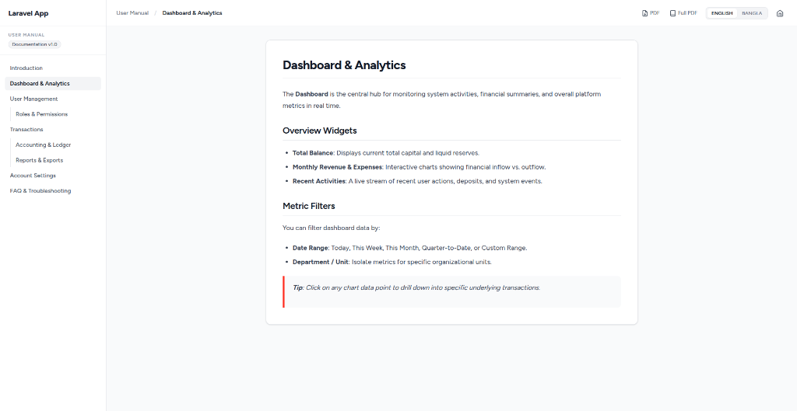

# Laravel User Manual

A markdown-based in-app user manual and help center for Laravel applications with multi-locale support, permission-aware navigation, and dynamic PDF exports.

[](https://packagist.org/packages/muhammadmahedihasan/laravel-user-manual)
[](https://github.com/muhammadmahedihasan/laravel-user-manual/actions)
[](https://packagist.org/packages/muhammadmahedihasan/laravel-user-manual)
[](LICENSE)



## Contents

- [Why?](#why)
- [Features](#features)
- [Quick Start](#quick-start)
- [Installation](#installation)
- [Content Structure](#content-structure)
- [Configuration](#configuration)
- [PDF Export](#pdf-export)
- [Permissions](#permissions)
- [AI Authoring](#ai-authoring)
- [Why Laravel User Manual?](#why-laravel-user-manual)
- [Commands](#commands)
- [Development](#development)
- [Contributing](#contributing)
- [Security](#security)
- [Changelog](#changelog)
- [License](#license)

---

## Why?

SaaS applications, ERP systems, and internal admin tools frequently require an integrated user manual, help center, or knowledge base. Building a custom documentation engine often leads to unmaintained Blade views, hardcoded links, iframe widgets, or unmanaged access permissions for confidential guides.

Laravel User Manual solves this by turning plain Markdown files into a secure, responsive in-app documentation portal. Because your documentation lives directly inside your repository, it stays version-controlled, testable, and synchronized with your application code—without external SaaS subscriptions, database tables, or third-party widgets.

### Use this package when you need to:
- Store version-controlled Markdown documentation directly inside your application repository.
- Serve localized, multi-language user guides and admin documentation.
- Restrict sensitive documentation pages to specific roles or permissions using your existing authorization logic.
- Export styled, branded PDF user manuals for offline distribution.
- Deliver a fast, in-app knowledge base without database tables or external service dependencies.

---

## Features

### Documentation & Content
- **Markdown-First**: Write documentation using standard GitHub-Flavored Markdown (GFM).
- **Dynamic Navigation**: Build clean multi-level sidebar navigation from a simple `navigation.md` file.
- **Version Management**: Organize documentation sets by product release versions (e.g., `1.0`, `2.0`).

### Localization & Multi-Language
- **Multi-Locale Routing**: Serve language-specific documentation out of the box (e.g., `/user-manual/en/...`, `/user-manual/bn/...`).
- **Locale-Aware Formatting**: Automatically format page numbers, TOC indexes, and dates using localized numeral scripts (such as Bengali digits via PHP `intl`).

### Security & Access Control
- **Permission Mapping**: Control access to individual pages or sub-sections via Laravel permissions or roles.
- **Super Admin Bypass**: Assign roles that automatically bypass documentation restrictions.
- **Custom Access Resolvers**: Extend authorization logic using a closure-based facade callback.
- **Safe CommonMark Defaults**: Protect your app against stored XSS by automatically escaping raw HTML and blocking unsafe `javascript:` links by default.

### Performance & Caching
- **Automatic Cache Invalidation**: Cache rendered Markdown and navigation trees using file modification timestamps (`filemtime`), invalidating instantly when `.md` files are edited.
- **Zero Database Load**: Deliver cached documentation pages and PDF files with sub-5ms response times.

### PDF Export
- **Single Page & Full Manual**: Generate downloadable PDF documents for individual pages or compile the entire manual into a single PDF.
- **Branded Layouts**: Customize cover pages, tables of contents, headers, and footers using Blade templates.
- **Custom Typography**: Support custom TrueType fonts for non-Latin character sets via mPDF integration.

---

## Quick Start

Get up and running with your first documentation page in a few simple steps:

1. **Install the package**:
   ```bash
   composer require muhammadmahedihasan/laravel-user-manual
   ```

2. **Publish assets and configuration**:
   ```bash
   php artisan vendor:publish --tag=user-manual
   ```
   *(Demo documentation stubs for `navigation.md` and `introduction.md` are automatically generated on first boot).*

3. **Configure navigation (`resources/user-manual/1.0/en/navigation.md`)**:
   ```markdown
   - [Introduction](/user-manual/en/introduction)
   ```

4. **Write documentation (`resources/user-manual/1.0/en/introduction.md`)**:
   ```markdown
   # Introduction

   Welcome to the application user manual.
   ```

5. **View in browser**:
   Navigate to `/user-manual` in your browser.

---

## Installation

### System Requirements
- **PHP**: `^8.2` (Laravel 13 requires PHP `^8.3`)
- **Laravel Framework**: `^11.0`, `^12.0`, or `^13.0`
- **Extensions**: `ext-intl`

### Install Package
```bash
composer require muhammadmahedihasan/laravel-user-manual
```

### Publish Package Resources
Publish configuration files, Blade views, language translations, assets, and documentation stubs:

```bash
php artisan vendor:publish --tag=user-manual
```

To publish components selectively:

```bash
php artisan vendor:publish --tag=user-manual-config
php artisan vendor:publish --tag=user-manual-views
php artisan vendor:publish --tag=user-manual-lang
php artisan vendor:publish --tag=user-manual-assets
php artisan vendor:publish --tag=user-manual-docs
```

---

## Content Structure

Documentation files are organized inside `resources/user-manual/{version}/{locale}/`:

```
resources/user-manual/
└── 1.0/
    ├── en/
    │   ├── navigation.md
    │   ├── introduction.md
    │   └── user-management.md
    └── bn/
        ├── navigation.md
        ├── introduction.md
        └── user-management.md
```

### Title Extraction
The renderer automatically extracts the first `# H1` header in the Markdown file for page titles and browser header tags. If no `# H1` header is found, it formats the filename slug into words.

### Navigation Hierarchy
Sidebar navigation is driven by `navigation.md` in each locale directory. Indent items by two spaces to create nested sub-sections:

```markdown
- [Introduction](/user-manual/en/introduction)
- [User Management](/user-manual/en/user-management)
  - [Roles & Permissions](/user-manual/en/roles-and-permissions)
- [External Help](https://example.com/support)
```

---

## Configuration

Publishing `config/user-manual.php` provides control over routing, security, caching, and layout options:

```php
return [
    'route_prefix' => 'user-manual',
    'route_name' => 'user-manual.show',
    'middleware' => ['web', 'auth'],
    'version' => '1.0',
    'content_path' => resource_path('user-manual'),
    'default_page' => 'introduction',
    'locales' => ['en'],
    'default_locale' => 'en',
    'cache_ttl' => 3600,
    'cache_prefix' => 'user-manual',
    'super_admin_roles' => [],
    'permission-mapper' => [],
];
```

### Customizing UI & Host Application Styles
The package publishes pre-scoped assets (`user-manual.css` and `user-manual.js`) to `public/vendor/user-manual/`. To layer host application styles (such as Tailwind CSS entrypoints) on top of the manual layout, configure `ui.vite_assets`:

```php
'ui' => [
    'logo_url' => '/images/logo.svg',
    'home_url' => '/',
    'back_url' => '/dashboard',
    'vite_assets' => ['resources/css/app.css'],
    'primary_color' => '#FF2D20',
],
```

---

## PDF Export

Laravel User Manual provides single-page and full manual PDF exports using mPDF.

### Export Routes
- **Single Page PDF**: `/user-manual/{locale}/{page}/pdf` (`user-manual.pdf.page`)
- **Full Manual PDF**: `/user-manual/{locale}/export/pdf` (`user-manual.pdf.full`)

### PDF Features
- **Structured Indexing**: Automatically compiles all accessible documentation pages into a single PDF document with a table of contents.
- **Locale-Aware Numerals**: Adapts pagination (e.g. `1/10` vs `১/১০`) to the active locale.
- **Memory Efficiency**: Chunks large HTML streams during document assembly.

### Custom Fonts & Typography
To support custom fonts (e.g. non-Latin scripts), define font paths under `pdf.fonts` in `config/user-manual.php`:

```php
'pdf' => [
    'default_font' => 'kalpurush',
    'fonts' => [
        'font_dirs' => [resource_path('fonts')],
        'font_data' => [
            'kalpurush' => [
                'R' => 'kalpurush.ttf',
                'B' => 'kalpurush.ttf',
                'useOTL' => 0xFF,
                'useKashida' => 75,
            ],
        ],
    ],
],
```

### Customizing Covers, Headers & Footers
Publish views (`php artisan vendor:publish --tag=user-manual-views`) to customize PDF templates in `resources/views/vendor/user-manual/pdf/`:
- `cover.blade.php`: Cover page header, subtitle, logo, and generation date.
- `header.blade.php`: Document running headers.
- `footer.blade.php`: Document running footers and page numbers.

### PDF Caching
PDF exports are cached using keys derived from source file modification timestamps (`filemtime`). Updating any Markdown content file or `navigation.md` automatically invalidates stale PDF caches.

**Full manuals are permission-scoped.** Each distinct accessible page set gets its own cache entry (keyed by an access signature), so a restricted viewer never receives a broader user's PDF.

**Payloads are stored on disk**, not in the Laravel cache value column. The cache store only keeps a small `'disk'` marker for TTL and invalidation; the base64 PDF lives under `pdf.cache_path` (default `storage/app/user-manual/pdfs`).

```php
'pdf' => [
    // On-disk directory for PDF cache payloads
    'cache_path' => storage_path('app/user-manual/pdfs'),

    // Warm full-manual PDFs during `php artisan user-manual:cache`
    'warm_full' => true,

    // One full PDF per distinct accessible page set. Profile shapes:
    // - []                   → authenticated user, no extra permissions
    // - ['perm_a', 'perm_b'] → user with those permissions
    // - ['roles' => [...]]   → user with those roles (may also list perms)
    // - ['*'] or 'all'       → unrestricted access to every page
    'warm_profiles' => [
        [],
        // ['material_access'],
    ],
],
```

With the default profile (`[]`), `user-manual:cache` warms the full manual that a normal authenticated user would download. Add more profiles when you have restricted pages so those variants are warm too. Set `warm_full` to `false` to skip full-manual warming (page PDFs are still warmed).

> **Note:** Large full-manual PDFs with images are memory-heavy. On a low PHP `memory_limit`, generating or downloading a big full PDF may fail with a memory exhaustion error. Raise the limit in your host `php.ini`, FPM pool, or queue worker if that happens.

---

## Permissions

Restrict access to specific documentation pages by setting rules in `permission-mapper` inside `config/user-manual.php`.

### Permission Mapping Examples
```php
'permission-mapper' => [
    // Accessible to all authenticated users
    'introduction' => '*',

    // Requires any one of the specified permissions
    'financials' => ['view_financials', 'manage_billing'],

    // Requires any one of the specified roles
    'system-admin' => ['roles' => ['Super Admin', 'Admin']],
],
```

- Pages not specified in `permission-mapper` default to accessible for all authenticated users.
- Unauthorized pages are automatically removed from navigation menus and PDF exports.
- Roles specified in `super_admin_roles` bypass all permission checks.

### Custom Access Resolver
For complex authorization logic, register a callback using the `UserManual` facade:

```php
use MuhammadMahediHasan\UserManual\Facades\UserManual;

UserManual::resolveAccessUsing(function ($user, string $slug, array $requirements): ?bool {
    if ($user->isOwner()) {
        return true;
    }

    return null; // Fall back to standard permission mapping
});
```

---

## AI Authoring

This package ships an AI skill definition (`SKILL.md`) for AI coding assistants (such as Claude Code, Antigravity, or Cursor).

### Supported Workflows
- **Proactive Documentation**: Instruct your AI agent to write or update user manual pages whenever a new user-facing feature is completed.
- **Conventions Enforcement**: Teaches AI assistants exact file placement (`resources/user-manual/{version}/{locale}/{slug}.md`), slug validation (`[a-z0-9-]+`), header formatting, `navigation.md` structures, and permission mappings.

To enable, copy `SKILL.md` into your workspace skill directory (e.g., `.claude/skills/laravel-user-manual-authoring.md` or `.agents/skills/laravel-user-manual-authoring/SKILL.md`).

---

## Why Laravel User Manual?

- **Version-Controlled Docs**: Keep your documentation inside your Git repository alongside application code.
- **Zero External Dependencies**: No monthly SaaS fees, third-party iframe widgets, or external API rate limits.
- **Native Authorization**: Restrict sensitive guides using your existing Laravel roles, permissions, and auth guards.
- **Offline PDF Exports**: Generate branded, single-page or full-manual PDFs directly from your Markdown source files.
- **Multi-Language Support**: Provide localized user manuals with locale-aware routing and numeral formatting out of the box.
- **Zero Database Footprint**: Runs entirely on file modification timestamps and application cache without database migrations.
- **AI Authoring Ready**: Includes an AI skill definition (`SKILL.md`) so AI assistants can write and maintain docs automatically.

---

## Commands

```bash
# Pre-render navigation, markdown HTML, page PDFs, and configured full-manual PDF variants
php artisan user-manual:cache

# Clear cached navigation, rendered markdown, PDF markers, and on-disk PDF payloads
php artisan user-manual:clear-cache
```

`user-manual:cache` clears first, then warms. Full-manual warming uses synthetic access profiles (`pdf.warm_profiles`) so the console never caches an empty “no user” manual. After a successful warm, the first matching web full-export is a cache hit.

---

## Development

Run tests and static analysis from the package directory:

```bash
# Run unit and feature tests with Pest
composer test

# Check code formatting with Laravel Pint
composer pint

# Execute static analysis with PHPStan
composer phpstan
```

---

## Contributing

Contributions are welcome. Please ensure all pull requests include tests and pass Pint formatting (`composer pint`) and PHPStan analysis (`composer phpstan`).

---

## Security

If you discover a security vulnerability within Laravel User Manual, please email the maintainer directly instead of opening a public issue. By default, Safe CommonMark settings escape raw HTML tags and strip `javascript:` URIs to prevent XSS vulnerabilities.

---

## Changelog

Please see [CHANGELOG.md](CHANGELOG.md) for details on recent releases.

---

## License

The MIT License (MIT). Please see [LICENSE](LICENSE) for more information.
